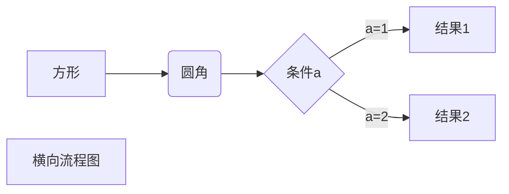

### 观察者模式定义
第一段**strong tex## Headingt*****strong t~~

 - [ ] 

> strikethrough text
> `e
|
|nter code here|  |
|--------------|--|
|              |  |
|  |
|--------------|--|
|              |  |


~~ext***

|1111111111         |  |
|:------:|------|------|------|
| 2    |2 |
| 3|4|
[baidu]

[baidu]: http://www.baidu.com


*斜体*
**粗体**
***粗斜体***
~~删除线~~
<u>下划线</u>
脚注[^hahha]

[^hahha]:hello,脚注！


+ 1
+ 2
+ 3
* 1
* 2
* 3
- 1
- 2
- 3


hell

 1. 222
	 - dd
	 - dd
	 - d
2.  djfd
> 11
     >+ dd
> 22
> 33

* 222
    >ddd
    >dddd
    >dddd
* 222
` public Object currentDateTime(BusinessMessage businessMessage){  
   return new SimpleDateFormat("yyyy-MM-dd HH:mm:ss").format(new Date());  
			}`

```
public Object currentDateTime(BusinessMessage businessMessage){  
   return new SimpleDateFormat("yyyy-MM-dd HH:mm:ss").format(new Date());  
}
public Object currentDateTime(BusinessMessage businessMessage){  
   return new SimpleDateFormat("yyyy-MM-dd HH:mm:ss").format(new Date());  dddddddddddd 
}public Object currentDateTime(BusinessMessage businessMessage){  
   return new SimpleDateFormat("yyyy-MM-dd HH:mm:ss").format(new Date());  
}public Object currentDateTime(BusinessMessage businessMessage){  
   return new SimpleDateFormat("yyyy-MM-dd HH:mm:ss").format(new Date());  
}
```

 [这是一个连接](https://www.baidu.com)
 <www.baidu.com>
\+ hehw


<!--stackedit_data:
eyJoaXN0b3J5IjpbNTYzOTI5MzQsMjAzMDExOTE0OCwyMDI0Mz
gxMjYzLDE3OTE5NDAxMjhdfQ==
-->